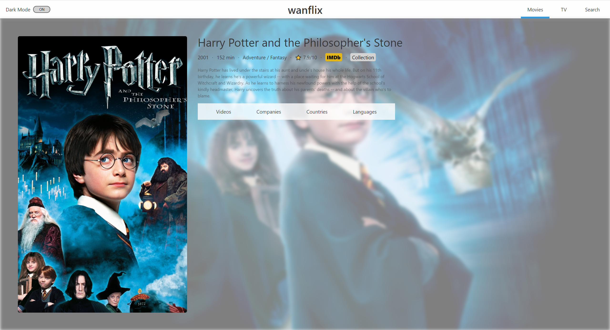

# Wanflixpo

"Wanflix" is an web application that helps people discover movies and tv shows.

Read this in other languages: [日本語](./README.md), [English](./README.en.md), [한국어](./README.ko.md)

## Release

<a href="https://wanflix.netlify.app/#/">View the site</a>

## Technologies

This project is created with:

- React: 16.12.0
- Styled components: 5.0.1

## Screenshots

|        |  |
| :----------------------------------------------------------------------------: | :---------------------------------------------------------------------------: |
|                             Movie lists (default)                              |                            Movie lists (dark mode)                            |
|      |     |
|                                     Detail                                     |                                    Search                                     |
|  |
|                                   Collection                                   |

## Features

Wanflix provides features like below.

### Listing Movies

Lists movies that are released recently, will be released soon, and etc.

### Listing TV shows

Lists TV shows that are ranked in top, popular recently, airing today, and etc.

### Search

Can search movies or TV shows by its title.

### Movie・TV show Detail

Can view the detail by selecting a movie or a TV show in the lists.\
Detail includes information such as overview, languages, genre, or teaser clips.

### Collection

Can view the information of entire movies of the series if the selected movie is included in that series.
