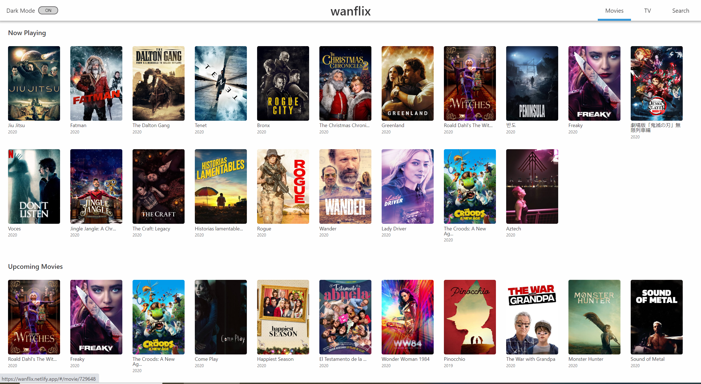
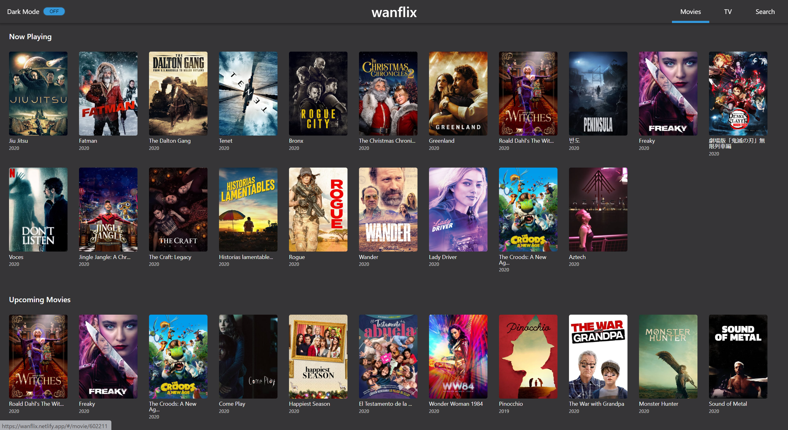
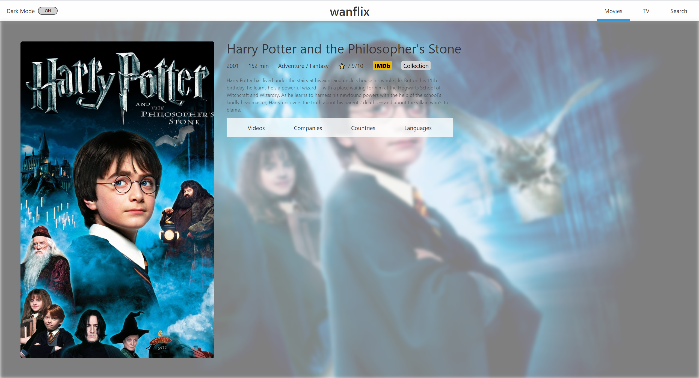
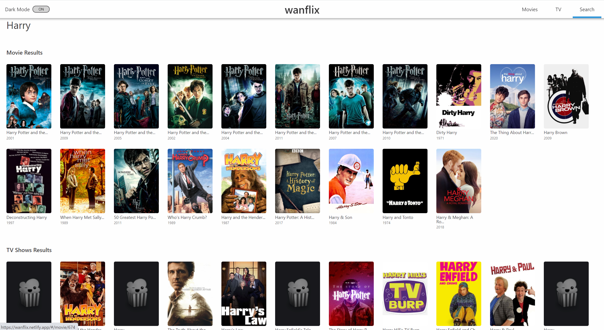
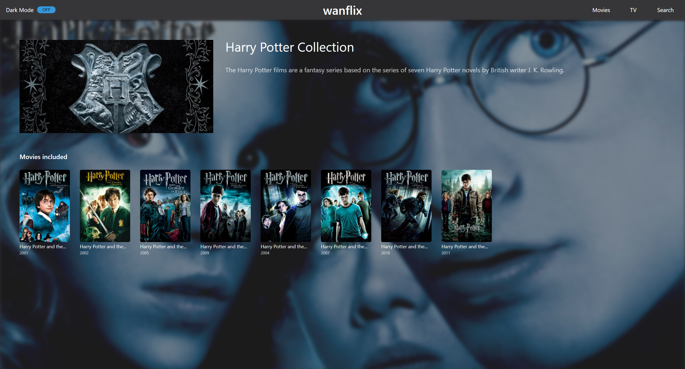

# Wanflix

「Wanflix」は映画情報提供の Web アプリケーションです。

Read this in other languages: [日本語](./README.md), [English](./README.en.md), [한국어](./README.ko.md)

## リリース

<a href="https://wanflix.netlify.app/#/">サイトへ</a>

## 使用技術

このプロジェクトで使った主な技術は以下のどおりです。

- React: 16.12.0
- Styled components: 5.0.1

## スクリーンショット

|        |  |
| :----------------------------------------------------------------------------: | :---------------------------------------------------------------------------: |
|                             映画一覧 (デフォルト)                              |                            映画一覧 (ダークモード)                            |
|      |     |
|                                    作品詳細                                    |                                     検索                                      |
|  |
|                                  コレクション                                  |

## 機能

wanflix では、以下のような機能が利用できます。

### 映画一覧

最近公開された映画、まもなく公開する映画などの一覧を表示します。

### TV ショー一覧

評点が高い TV ショー、最近人気の TV ショー、今日放映予定の TV ショーなどの一覧を表示します。

### 検索

タイトルで映画や TV ショーを検索できます。

### 作品詳細

一覧の映画や TV ショーをクリックすることで作品の詳細を見ることができます。\
作品概要・言語・ジャンル・ティーザー動画などの情報が表示されます。

### コレクション

シリーズとして公開された映画のシリーズ全体の映画一覧を表示します。
